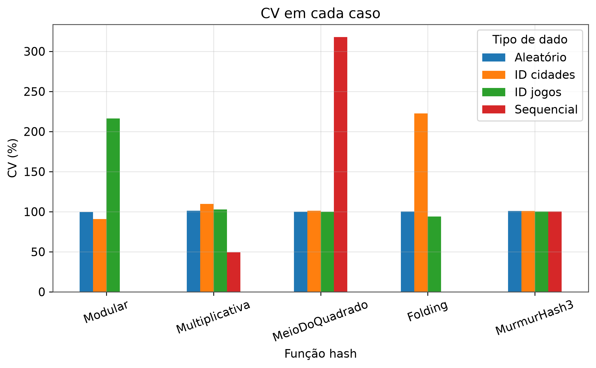

# HashMap-Experimentation

Comparação experimental entre cinco funções hash (**Modular**, **Multiplicativa**,
**Meio do Quadrado**, **Folding** e **MurmurHash3**) quanto ao número de colisões,
à qualidade da distribuição das chaves e ao comprimento das cadeias geradas,
utilizando encadeamento separado (separate chaining) como estratégia de
tratamento de colisões.

Projeto desenvolvido ára as disciplinas de Estrutura de Dados e Algoritmos (EDA) e Laboratório de Estrutura de Dados e Algoritmos (LEDA) - UFCG, sob orientações do docente João Arthur Brunet Monteiro.

**Discentes:**
Deborah dos Santos Araujo<br>
Ewerton Danilo Gouveia Tavares<br>
Hanna Martins Queiroga.

## Sobre o projeto

Tabelas hash são estruturas amplamente utilizadas por buscarem operações de
inserção, busca e remoção em tempo médio O(1), estando presentes em bancos de
dados, caches, dicionários e diversas outras aplicações. Esse desempenho,
porém, depende diretamente da qualidade da função hash utilizada: quando
chaves diferentes são mapeadas para o mesmo índice (colisão), o desempenho da
estrutura se degrada.

Este projeto investiga experimentalmente o quanto diferentes funções hash
conseguem distribuir chaves de forma uniforme — e, consequentemente, reduzir
colisões e o comprimento das cadeias — quando aplicadas a conjuntos de dados
sintéticos (sequenciais e aleatórios) e reais (IDs de jogos da Steam e
códigos de municípios brasileiros do IBGE), em escalas de 10³ a 10⁶ chaves.

A fundamentação teórica, a metodologia completa, a análise detalhada dos
resultados e as ameaças à validade estão documentadas no relatório do
experimento:

**Comparação Experimental entre Funções Hash — documento completo:** https://docs.google.com/document/d/1rKdVZx1dZ-iagOMbKEOZDX5T3uS06RAF4hM2ymFpwY4/edit?usp=sharing

## Resumo dos resultados



A análise completa — incluindo os gráficos por dataset, a discussão de cada
caso e as ameaças à validade — está no documento linkado acima.

## Estrutura do projeto

```
├── src/main/java/
│   ├── Benchmark.java        # executa o benchmark e gera os CSVs
│   └── hash/                 # implementações das funções hash
├── src/main/scripts/
│   └── plot_resultados.py    # geração dos gráficos a partir dos CSVs
├── dados/                    # datasets de entrada (sequenciais, aleatórios, reais)
├── resultados/                # CSVs gerados pelo benchmark (um por dataset)
├── graficos/                  # gráficos gerados (não versionado)
└── docs/                      # documento completo do experimento (PDF)
```

## Instruções de execução

**1. Compilar e executar o benchmark no diretório da raiz do projeto** (repetir para cada dataset desejado):

```bash
   javac src/main/java/hash/*.java src/main/java/Benchmark.java
   java src.main.java.Benchmark
```

O programa solicita o tamanho da tabela e o nome do arquivo de chaves (na
pasta `dados/`), e gera um novo CSV em `resultados/`.


**3. Gerar os gráficos** a apartir de todos resultados consolidados:

```bash
   python3 src/main/scripts/plot_resultados.py
```

lê todos os CSVs de `resultados/` automaticamente e salva as figuras em `graficos/`

## Tecnologias

- Java 17+
- Pyhton 3 (panda, matplotlib, numpy)

## Referências

As referências bibliográficas completas (Cormen et al., Knuth, Appleby,
Goodrich et al., Montgomery e Runger) estão listadas no documento completo do
experimento.
